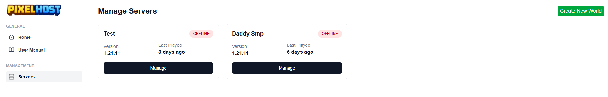
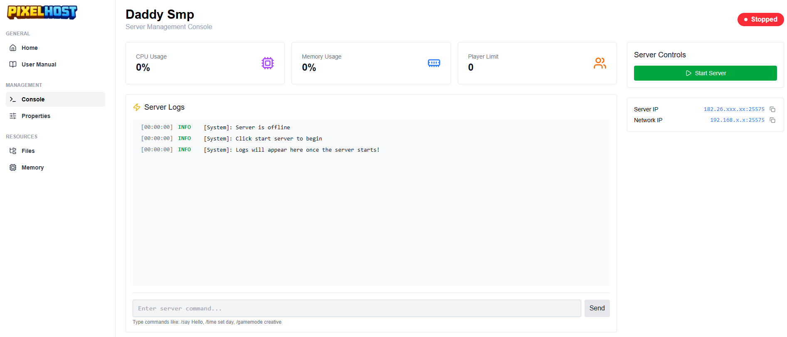

  

  <b>Open‑source Minecraft server hosting for home servers & homelabs</b>

---

## 🚀 What is PixelHost?

**PixelHost** is an open‑source Minecraft hosting panel built for people who run their own servers at home or in a homelab.

It focuses on simplicity, performance, and full control over your resources.

---

## ✨ Features

- 🧩 **Multiple Server Management**
  Create and manage multiple Minecraft servers from a single dashboard.

- ⚙️ **Server Properties Configuration**
  Edit `server.properties` and related settings directly from the panel.

- 🧠 **Resource Allocation**
  Control RAM, CPU, and other resource limits per server.

- ▶️ **Easy Controls**
  Start, stop, and restart servers with one click.

- 📜 **Live Logs**
  View real‑time server logs from the web UI.

- 💾 **Backups**
  Create and manage backups of your Minecraft worlds.

- 🏠 **Home‑Server Friendly**
  Designed specifically for self‑hosted environments and homelabs.

---

## 🖼 Screenshots

---

## 🤝 Contributing

PixelHost is **open source**, and contributions are welcome!

- Fork the repository
- Create a feature branch
- Submit a pull request

If you find bugs or have feature requests, please open an issue.

---

## 📄 License

This project is licensed under the **MIT License**.

---

## ⭐ Support the Project

If you like PixelHost, consider giving the repo a ⭐ and sharing it with other Minecraft server admins running home servers!

---

**Built for the homelab & self‑hosting community ❤️**
